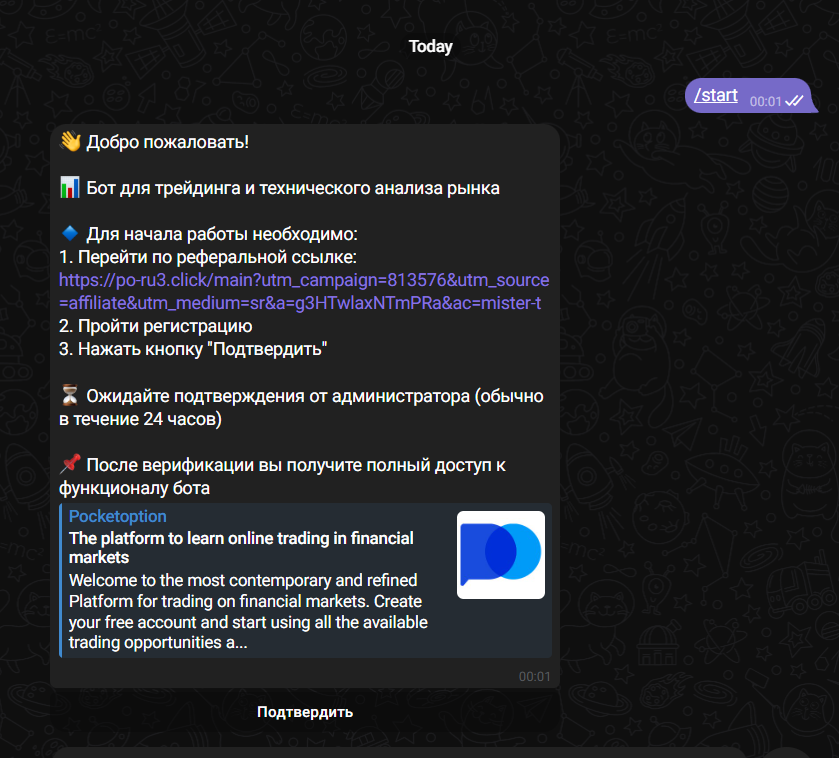
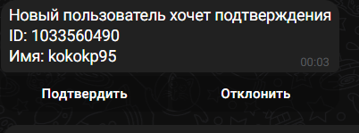
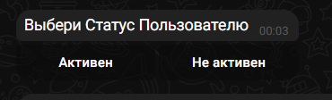
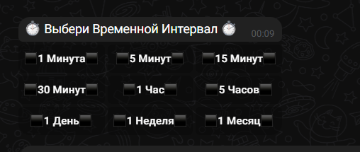
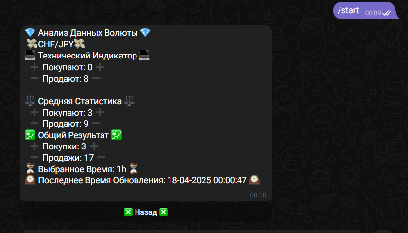

# 📈 Торговый бот для Telegram

Бот для анализа рыночных данных с интеграцией в Telegram

## ⚙️ Технические требования
- Python 3.12
- Хромдрайвер для Selenium
- Доступ к Telegram API

## 🛠 Установка

### 1. Установите зависимости:

pip install -r requirements.txt

# Установка библиотек
```bash
pip install -r requirments.txt
```

# Создание файла .env
в .env создайте две переменные
в файле test.env показан пример

    TOKEN="Ваш токен"
    ADMIN1=Телеграм айди админа


# Начало
Пользователь вводит команду /start


После пользователь ждёт подтверждения


# Действие Админа
Админу приходит такое сообщение


Подтверждает и ставит статус нужный


после пользователю поступает сообщение


иначе 


# Пользование
Предлагают нужную волюту

Выбор интервала

Идет Сбор данных и выдача 
